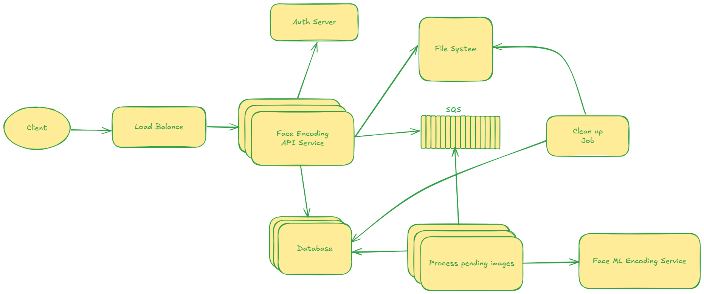

# Design Spec

## Sumary

Design solution for an API used to transform selfie images into ecoding using Veriff Face Ecoding Service.
Users can use transformation in sessions, each session accepts 1-5 images. Users can summarize sessions at any point.

## Overview

Two designs will be described:

- Final Solution: focus on high-availability clould solution.
- Demo Solution: small demo implementation for validation purpose.

## Final Solution

### Overview

Client will aways interact direct with API through a Load Balance. API will aways validate the authentication using global auth downstream, save the images on S3 and put the image to be processed in SQS, where a processing job will call ML face ecoding to save answer in the database.
A cleanup job is responsible to clean up expired and invalid sessions from database and S3.

### Technology choices

- Load Balance: Each endpoint has their cluster group choosen on the LB, inside the cluster group a simple round robin can delivery reasonable balance.
- Cluster using hot hosts where all the API is deployed in each host, but they are separeted by cluster group to improve specific performance for different API necessity. File upload doesn't has more calls and long responses while a session summary has fast database result.
- S3 for file system because the speed is not essential, and S3 provides good speed/price balance compared to HDFS.
- SQS for queue because it's easily integrated with lambda, and lambda is easy to maintain to process the faces ecoding.
- AWS Lambda to process the face images and save their results since it gives easier and costy maintainance for less latency sensitive processes.
- DDB for the database, a simple NOSQL can handle a large volume of data within a fast implementation.



### API Flow

1. Client request a session from the API
2. Client uploads images to a session
3. Client view session summary

### Tables

tb_sessions:

    session_id
    user_id
    created_at
    expired_at
    status

tb_images

    image_id
    session_id
    image_name
    image_type
    result

### Endpoints

#### POST /session

Create a new session for the user.

1. Validate user on Auth downstream
2. Generate a session_id
3. Create a record on tb_session
4. Return the session_id

Request:

```bash
curl -X POST
     "http://localhost:3030/v1/session" \
     --header 'accept: application/json' \
     --header "Content-Type: application/json" \
     --header "user_id: 1"
```

Response code 201:

```json
{
  "session_id": "177236b3-170c-4391-8a8b-fdbfb5d19088"
}
```

#### POST /image

Add a new image to a existent session.

1. Validate user on Auth downstream
2. Save image data on database
3. Save file on File System
4. Add file detail on SQS to be processed
5. Return `image_id`

```bash
curl -X POST
     "http://localhost:3030/v1/image/{session_id}" \
     --header 'accept: application/json' \
     --header "Content-Type: multipart/form-data" \
     --header "user_id: 1"
     -F "file=@/path/to/photo.jpg" \
     -d '{"image_name": "Jhon Foto"}' \
```

Response code 201:

```json
{
  "image_id": "177236b3-170c-4391-8a8b-fdbfb5d19088"
}
```

Response code 400:

```json
{
  "error": "Too many images. Limit is 5 messages per session."
}
```

#### GET /session/{session_id}

Return a session summary.

1. Validate user on Auth downstream
2. Return session details if session belongs to the user

Request:

```bash
curl -X GET
     "http://localhost:3030/v1/session/177236b3-170c-4391-8a8b-fdbfb5d19088" \
     --header 'accept: application/json' \
     --header "Content-Type: application/json" \
     --header "user_id: 1"
```

Response code 201:

```json
{
  "session_id": "177236b3-170c-4391-8a8b-fdbfb5d19088"
}
```

## Demo Solution

### Overview

The demo solution is a very simple design to have the minimum usability of the solution, therefore it won't be scalable and resilient. API will reamins the same, but all data will be stored and processed in the API level, using memory as database and image won't be stored, only the ecoding data result.


